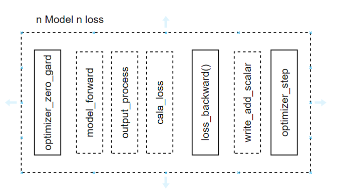

# Deep Learning PyTorch Training and Evaluation Framework



This is a unified deep learning PyTorch framework for training, testing, and evaluating models.


## V2 20240820
 - This Version will change the way of read the dataset from the list to a extra json and will not used the add bu mantual  


## Key Features
- Strong uniformity: The framework promotes a cohesive approach to training and evaluation.
- Reduced complexity: Minimizes intricacies, making it easier to use and modify.
- Increased interactivity: Facilitates interactive usage and experimentation.

The framework is designed to plan training, testing, and evaluation based on the number of models and loss functions. For simpler cases, like single model and loss, you can directly use this framework for tasks such as image segmentation, denoising, and various end-to-end tasks. For more complex training strategies, you can easily use other basic types and modify the network input flow and evaluation process accordingly.

## Model Functionality
- Real-time display of loss functions and test metrics during training.
- Support for checkpoint-based continuation of training.
- Evaluation of models and loading pretrained models.

## Dataset Section
We maintain flexibility in dataset requirements, allowing you to implement your own methods. A dataset that conforms to our requirements should have the following structure:
- Dataset files can be located anywhere, but in the 'Code-dataset' directory, create a folder with the dataset's name.
- Inside this folder, place corresponding text (txt) files. The first line of each text file should contain the image file's path.

## Models
All models should be placed in the 'src.model' directory. Use the 'make-model' function to pass 'args' parameters to the model and return an instantiated model instance.

## Loss Functions
You can add your own loss functions and integrate them into the appropriate loss category using the 'load-extra loss' member function.

## Usage Examples


### Train one model one loss
```commandline
python main.py --model baselineunet --resume -2 --data_train N20DegradeFittingv1 --data_test N20DegradeFittingv1 --loss 1*L1 --lr 1e-4  --epoch 1000 --batch_size 1 --print_every 10 --crop_traindata True --crop_testdata False --argument_scale 4 --patch_size 256 --rgb_range 1 --ressave_path Onemodel-test

```

 ### Retrain one model one loss
```commandline
python main.py --model baselineunet --resume -1 --data_train N20DegradeFittingv1 --data_test N20DegradeFittingv1 --loss 1*L1 --lr 1e-4  --epoch 1000 --batch_size 1 --print_every 10 --crop_traindata True --crop_testdata False --argument_scale 4 --patch_size 256 --rgb_range 1 --resload_path [onemodel-test]-[N20DegradeFittingv1]-[2023-10-19-05-25]

```

### Evluation one model one loss
```commandline
python main.py --model baselineunet --resume 0  --data_test N20DegradeFittingv1  --crop_testdata False --rgb_range 1 --pre_train [onemodel-test]-[N20DegradeFittingv1]-[2023-10-19-05-25]  --test_only

```


### Pretrain one model one loss
```commandline
python main.py --model baselineunet --resume 0 --data_train N20DegradeFittingv1 --data_test N20DegradeFittingv1 --loss 1*L1 --lr 1e-4  --epoch 1000 --batch_size 1 --print_every 10 --crop_traindata True --crop_testdata False --argument_scale 4 --patch_size 256 --rgb_range 1 --pre_train [onemodel-test]-[N20DegradeFittingv1]-[2023-10-19-05-25] --ressave_path onemodel-test

```

### Train one model two loss 
Train one model two loss 
```python
python main_2loss.py --model baselineunet --resume -2 --data_train N20DegradeFittingv1 --data_test N20DegradeFittingv1 --loss 1*L1 --loss2 1*MSE --lr 1e-4  --epoch 1000 --batch_size 1 --print_every 10 --crop_traindata True --crop_testdata False --argument_scale 4 --patch_size 256 --rgb_range 1 --ressave_path onemodel_twoloss-test

```


### Retrain one model two loss 
```python
python main_2loss.py --model baselineunet --resume -1 --data_train N20DegradeFittingv1 --data_test N20DegradeFittingv1 --loss 1*L1 --loss2 1*MSE --lr 1e-4  --epoch 1000 --batch_size 1 --print_every 10 --crop_traindata True --crop_testdata False --argument_scale 4 --patch_size 256 --rgb_range 1 --resload_path [onemodel_twoloss-test]-[N20DegradeFittingv1]-[2023-10-19-05-58]

```

### Evaluation one model two loss
```python
python main_2loss.py --model baselineunet --resume 0 --data_test N20DegradeFittingv1  --batch_size 1 --print_every 10 --crop_testdata False --argument_scale 4 --patch_size 256 --rgb_range 1 --pre_train [onemodel_twoloss-test]-[N20DegradeFittingv1]-[2023-10-19-05-58] --test_only 

```


### Train two model two loss
Train two model two loss 
```python
python main_2model.py --model baselineunet --model2 ridnet --resume -2 --data_train N20DegradeFittingv1 --data_test N20DegradeFittingv1 --loss 1*MSE --loss2 1*L1 --lr 1e-4  --epoch 1000 --batch_size 2 --print_every 10 --crop_traindata True --crop_testdata False --argument_scale 4 --patch_size 64 --rgb_range 1 --ressave_path twomodel_twoloss-test

```
### Retrain  two model two loss
```python
python main_2model.py --model baselineunet --model2 ridnet --resume -1 --data_train N20DegradeFittingv1 --data_test N20DegradeFittingv1 --loss 1*MSE --loss2 1*L1 --lr 1e-4  --epoch 1000 --batch_size 2 --print_every 10 --crop_traindata True --crop_testdata False --argument_scale 4 --patch_size 64 --rgb_range 1 --resload_path [twomodel_twoloss-test]-[N20DegradeFittingv1]-[2023-10-18-23-42]

```
### Evaluation  two model two loss
```python
python main_2model.py --model baselineunet --model2 ridnet --resume 0 --data_train N20DegradeFittingv1 --data_test N20DegradeFittingv1 --loss 1*MSE --loss2 1*L1 --lr 1e-4  --epoch 1000 --batch_size 2 --print_every 10 --crop_traindata True --crop_testdata False --argument_scale 4 --patch_size 64 --rgb_range 1 --pre_train [twomodel_twoloss-test]-[N20DegradeFittingv1]-[2023-10-18-23-42] --test_only 

```


